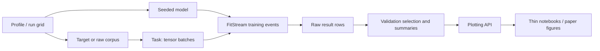

# Code structure

The repository is easiest to understand as a research pipeline rather than as
a collection of modules:



The main code lives under [`src/paper/`](src/paper/). Targets and raw datasets
produce tasks, tasks feed tensor batches to models, and the training layer emits
checkpoint events. Experiment modules turn those events into result tables;
selection and plotting happen afterward.

## 1. Core contracts

### Tasks define the data/training boundary

[`tasks.py`](src/paper/tasks.py) defines the common batch contract:

```text
(model_inputs, labels)
```

`model_inputs` is always a tuple, allowing training to call
`model(*model_inputs)` uniformly:

- dense models receive `((x,), y)`;
- sparse models can receive `((feature_ids, feature_values), y)`.

`TrainTask` promises training batches, while `Task` adds fresh validation and
test iterators. These are structural protocols rather than framework base
classes, so `SyntheticTask`, `HiggsTask`, and `CriteoTask` can implement the
same small interface without sharing an artificial inheritance hierarchy.

Tasks own sampling, data access, and NumPy-to-Torch conversion. Models and
training code operate only on tensors.

For synthetic data, `SyntheticTask` generates reproducible uniform training
samples. The univariate test set is linearly spaced; the bivariate test set is
a tensor-product grid. Test labels are exact target values without training
noise.

### Models contain the mathematical primitives

[`models.py`](src/paper/models.py) contains the spectral neurons and comparison
models:

- `TrilEmbed` maps compact lower-triangular coordinates to a symmetric matrix.
- `KthEigval` implements a dense spectral neuron:

  ```text
  features
    -> affine triangular coordinates
    -> symmetric matrix
    -> ordered eigenvalues
    -> selected eigenvalue
  ```

- `KthEigvalLastMonotone` gives the last feature a positive-semidefinite matrix
  coefficient, enforcing monotonicity in that feature.
- `SparseLinear`, `FactorizationMachine`, and `SparseMiddleEigval` implement the
  Criteo comparison families with a shared sparse-input convention.
- `ModelSpec` and `make_model` form the small factory used by synthetic
  experiments.
- `make_seeded_model` scopes model initialization with
  `torch.random.fork_rng`, preserving the caller's global RNG state.

[`targets.py`](src/paper/targets.py) contains the NumPy-only synthetic target
generators: general, monotone, and convex targets in one or two dimensions.
`TargetSpec` is their reproducible identity, while `make_target` and
`make_bivariate_target` perform seeded dispatch.

## 2. FitStream-native training

[`training.py`](src/paper/training.py) is the center of the experiment
infrastructure. `train_events` is the single training loop. It consumes one
continuous training iterator and yields a FitStream event at each requested
checkpoint containing:

- the live model;
- optimizer step;
- cumulative number of examples seen;
- cumulative training time.

Downstream FitStream transformations consume an event before training resumes,
so metrics are evaluated against the model at exactly that checkpoint.

The synthetic path composes the stream as follows:

```text
train_events
  -> augment with validation metrics
  -> augment with test metrics
  -> collect_pd
```

The relevant functions are `train_events`, `evaluate_on`, and
`fit_and_evaluate`. `Objective` bundles the loss and the validation/test metric
sets.

Real-data scaling uses the same event source but separates selection from final
reporting:

- `fit_validation_trajectory` evaluates every tuning checkpoint;
- validation metrics select learning rates and checkpoints;
- `fit_test_trajectory` trains a fresh model continuously and evaluates only
  the selected checkpoints.

[`tuning.py`](src/paper/tuning.py) contains validation-only learning-rate
selection. It scores each candidate by median validation performance across
seeds, rejects candidates with nonfinite trials, and breaks exact ties toward
the lower learning rate.

[`shuffling.py`](src/paper/shuffling.py) supports the large datasets. Its
`ShuffledEpochs` object persists deterministic permutations and exposes them as
one continuous minibatch stream. Row IDs are sorted within each minibatch for
memory-mapped access without changing random batch membership.

## 3. Experiment orchestration

The experiment layer has one synthetic path, one shared real-data scaling path,
and one downstream robustness analysis:

| Experiment | Entry module | Data/task layer | Orchestration |
| --- | --- | --- | --- |
| Univariate | [`univariate.py`](src/paper/experiments/univariate.py) | [`tasks.py`](src/paper/tasks.py) | [`synthetic.py`](src/paper/experiments/synthetic.py) |
| Bivariate | [`bivariate.py`](src/paper/experiments/bivariate.py) | [`tasks.py`](src/paper/tasks.py) | [`synthetic.py`](src/paper/experiments/synthetic.py) |
| HIGGS scaling | [`higgs_scaling.py`](src/paper/experiments/higgs_scaling.py) | [`higgs.py`](src/paper/higgs.py) | [`scaling.py`](src/paper/experiments/scaling.py) |
| Criteo scaling | [`criteo_scaling.py`](src/paper/experiments/criteo_scaling.py) | [`criteo.py`](src/paper/criteo.py) | [`scaling.py`](src/paper/experiments/scaling.py) |
| HIGGS robustness | [`higgs_robustness.py`](src/paper/experiments/higgs_robustness.py) | [`higgs.py`](src/paper/higgs.py) | Selected HIGGS scaling runs |

[`runner.py`](src/paper/experiments/runner.py) provides serial or
process-parallel mapping with progress reporting. [`results.py`](src/paper/experiments/results.py)
owns result writing and median/interquartile summaries.

### Synthetic experiments

[`synthetic.py`](src/paper/experiments/synthetic.py) contains the complete
synthetic workflow:

- `Profile` defines sweep axes;
- `RunGrid` expands target, model, learning-rate, noise, and seed combinations;
- `run_config` constructs one target, task, seeded model, and training
  trajectory;
- `run_profile` maps `run_config` over the grid;
- `summarize_results` selects checkpoints and learning rates using validation
  RMSE, then summarizes test RMSE across evaluation seeds.

[`univariate.py`](src/paper/experiments/univariate.py) and
[`bivariate.py`](src/paper/experiments/bivariate.py) are intentionally thin.
They provide the appropriate target factory, task factory, and complexity set,
then delegate to the shared synthetic workflow.

An end-to-end univariate run follows this path:

```text
univariate entry point
  -> synthetic Profile and RunGrid
  -> run_config
  -> target + SyntheticTask + model
  -> training.fit_and_evaluate
  -> raw checkpoint table
  -> synthetic.summarize_results
  -> plotting.plot_general_scaling or plot_monotone_scaling
```

### Shared real-data scaling

[`scaling.py`](src/paper/experiments/scaling.py) defines the generic protocol
used by HIGGS and Criteo:

- `ScalingSchema` describes the persisted result table;
- `SeedGrid`, `RunConfig`, and `SelectedRun` describe tuning and evaluation
  runs;
- `ScalingRunner` accepts domain callbacks for task/model construction and
  metadata;
- `run_tuning_and_evaluation` runs tuning, selects configurations, retrains
  fresh models, and evaluates their test metrics;
- `select_evaluations` and `summarize_evaluations` produce the plotting table;
- `validate_results` checks that a retained artifact represents the expected
  experiment grid.

The shared runner owns the experiment protocol; dataset modules retain their
actual data and model policies.

### HIGGS

[`higgs.py`](src/paper/higgs.py) streams the raw CSV into memory-mapped features
and labels, computes training-only normalization statistics, exposes the fixed
train/validation/test split, and implements `HiggsTask`.

[`higgs_scaling.py`](src/paper/experiments/higgs_scaling.py) defines profiles,
capacity-matched linear/MLP/spectral model specifications, model construction,
and the callbacks passed to `ScalingRunner`.

The path is:

```text
prepare_corpus
  -> HiggsCorpus + ShuffledEpochs
  -> HiggsTask + model
  -> ScalingRunner tuning trajectories
  -> validation-selected configurations
  -> fresh test trajectories
  -> summarized binary metrics
```

### Criteo

[`criteo.py`](src/paper/criteo.py) is larger because it owns the full sparse
data pipeline:

- raw TSV to numeric, categorical, and label memmaps;
- training-only vocabulary and numeric preprocessing;
- bucketed and hybrid-continuous representations;
- cached encoded train/holdout arrays;
- `CriteoTask`, which emits the input tuple required by each sparse model.

[`criteo_scaling.py`](src/paper/experiments/criteo_scaling.py) binds the linear,
factorization-machine, and spectral variants to their required preprocessing
and delegates the training protocol to the same `ScalingRunner` used by HIGGS.

### HIGGS robustness

[`higgs_robustness.py`](src/paper/experiments/higgs_robustness.py) is downstream
scientific analysis rather than another scaling framework. It reads selected
spectral configurations from the HIGGS scaling artifact, retrains them, extracts
their feature matrices, and measures perturbation deviations over the complete
test split. Its output is a compact histogram table rather than per-example
rows.

## 4. Results, plotting, and notebooks

[`plotting/__init__.py`](src/paper/plotting/__init__.py) is the curated public
plotting API. Notebook code should import from this facade instead of private
plotting modules.

The implementation is split by scientific domain:

- [`plotting/_common.py`](src/paper/plotting/_common.py) contains shared curve
  styles, facet construction, median lines, and interquartile bands;
- [`plotting/synthetic.py`](src/paper/plotting/synthetic.py) contains the
  general and monotone synthetic layouts;
- [`plotting/higgs.py`](src/paper/plotting/higgs.py) and
  [`plotting/criteo.py`](src/paper/plotting/criteo.py) contain real-data scaling
  views;
- [`plotting/robustness.py`](src/paper/plotting/robustness.py) aggregates and
  renders perturbation histogram shells;
- [`plotting/targets.py`](src/paper/plotting/targets.py) renders target
  galleries.

The notebooks in [`notebooks/`](notebooks/) are deliberately thin. They load a
retained raw artifact, validate its expected grid, select and summarize it, and
call the plotting API. Frozen result provenance is recorded in the
[`notebooks/runs` manifest](notebooks/runs/README.md).

## 5. Tests as executable documentation

The most useful files to read beside the implementation are:

- [`test_models.py`](tests/test_models.py): model mathematics, initialization,
  and shape contracts;
- [`test_tasks.py`](tests/test_tasks.py): task and data-boundary contracts;
- [`test_training.py`](tests/test_training.py): FitStream events and checkpoint
  behavior;
- [`test_tuning.py`](tests/test_tuning.py): validation-only selection;
- [`test_scaling.py`](tests/test_scaling.py): shared real-data orchestration;
- [`tests/plotting/`](tests/plotting/): pure plotting transforms and sparse
  visual-contract tests.

The dataset and experiment test modules add small end-to-end checks for HIGGS,
Criteo, synthetic profiles, and robustness analysis.

## Recommended reading order

For a first pass through the code:

1. Read [`tasks.py`](src/paper/tasks.py) to learn the batch contract.
2. Read [`models.py`](src/paper/models.py), especially `TrilEmbed` and
   `KthEigval`.
3. Follow `train_events` through `fit_and_evaluate` in
   [`training.py`](src/paper/training.py), with
   [`test_training.py`](tests/test_training.py) open beside it.
4. Trace [`univariate.py`](src/paper/experiments/univariate.py) into
   [`synthetic.py`](src/paper/experiments/synthetic.py) for the shortest complete
   experiment.
5. Read `ScalingRunner` in
   [`scaling.py`](src/paper/experiments/scaling.py), then its concrete HIGGS
   binding in [`higgs_scaling.py`](src/paper/experiments/higgs_scaling.py).
6. Read [`higgs.py`](src/paper/higgs.py) to see the real-data task boundary.
7. Read Criteo afterward; its architecture is the same, but preprocessing and
   cached sparse encodings add another layer.
8. Finish with the plotting facade and one corresponding notebook.
9. Read HIGGS robustness last: it demonstrates how selected scaling runs feed a
   second scientific analysis.

If inspecting only one function in depth, choose `train_events`: it is where
task iteration, model optimization, checkpoint semantics, and FitStream
composition meet.
